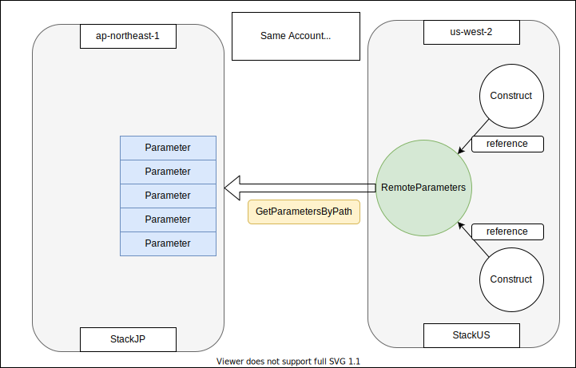
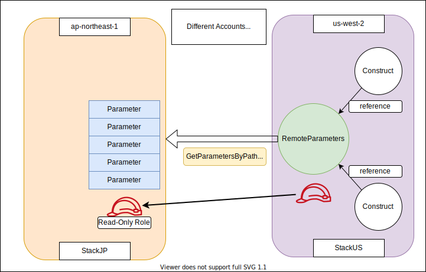
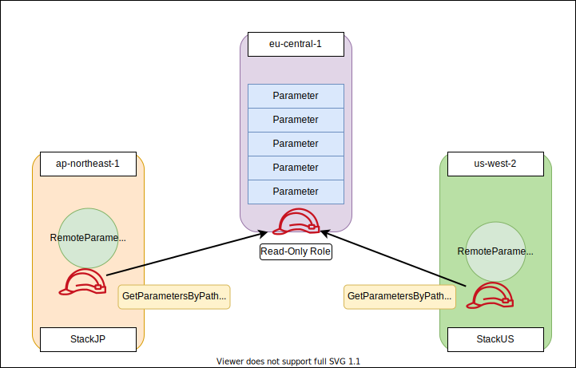

[](https://github.com/pahud/awscdk-jsii-template)
[](https://badge.fury.io/js/cdk-remote-stack)
[](https://badge.fury.io/py/cdk-remote-stack)


# cdk-remote-stack
Get outputs from cross-regional AWS CDK stacks

# Why

AWS CDK cross-regional cross-stack reference is not easy with the native AWS CDK construct library.

`cdk-remote-stack` aims to simplify the cross-regional cross-stack reference to help you easily build cross-regional multi-stack AWS CDK apps.

This construct library provides two major constructs:

- **RemoteOutputs** - cross regional stack outputs reference.
- **RemoteParameters** - cross regional/account SSM parameters reference.

# RemoteOutputs

`RemoteOutputs` is ideal for one stack referencing the outputs from another across different AWS regions.

Let's say we have two cross-regional CDK stacks in the same cdk app:

1. **stackJP** - cdk stack in `JP` to create a SNS topic
2. **stackUS** - cdk stack in `US` to get the Outputs from `stackJP` and print out the SNS `TopicName` from `stackJP` Outputs.


```ts
import { RemoteOutputs } from 'cdk-remote-stack';
import * as cdk from '@aws-cdk/core';

const app = new cdk.App();

const envJP = {
  region: 'ap-northeast-1',
  account: process.env.CDK_DEFAULT_ACCOUNT,
};

const envUS = {
  region: 'us-west-2',
  account: process.env.CDK_DEFAULT_ACCOUNT,
};

// first stack in JP
const stackJP = new cdk.Stack(app, 'demo-stack-jp', { env: envJP })

new cdk.CfnOutput(stackJP, 'TopicName', { value: 'foo' })

// second stack in US
const stackUS = new cdk.Stack(app, 'demo-stack-us', { env: envUS })

// ensure the dependency
stackUS.addDependency(stackJP)

// get the stackJP stack outputs from stackUS
const outputs = new RemoteOutputs(stackUS, 'Outputs', { stack: stackJP })

const remoteOutputValue = outputs.get('TopicName')

// the value should be exactly the same with the output value of `TopicName`
new cdk.CfnOutput(stackUS, 'RemoteTopicName', { value: remoteOutputValue })
```

At this moment, `RemoteOutputs` only supports cross-regional reference in a single AWS account.

## always get the latest stack output

By default, the `RemoteOutputs` construct will always try to get the latest output from the source stack, you may opt out by setting `alwaysUpdate` to `false` to turn this feature off.

For example:

```ts
const outputs = new RemoteOutputs(stackUS, 'Outputs', { 
  stack: stackJP,
  alwaysUpdate: false,
})
```

# RemoteParameters

AWS [SSM Parameter Store](https://docs.aws.amazon.com/systems-manager/latest/userguide/systems-manager-parameter-store.html) is great to store and persist parameters and allow stacks from other regons/accounts to reference. Let's dive into the two major scenarios below:

## #1 - Stacks from single account and different regions

In this sample, we create two stacks from JP(`ap-northeast-1`) and US(`us-west-2`). The JP stack will produce and update parameters in its parameter store, while the US stack will consume the parameters across differnt regions with the `RemoteParameters` construct.



```ts

    const envJP = { region: 'ap-northeast-1', account: '111111111111' };
    const envUS = { region: 'us-west-2', account: '111111111111' };

    // first stack in JP
    const producerStackName = 'demo-stack-jp';
    const stackJP = new cdk.Stack(app, producerStackName, { env: envJP });
    const parameterPath = `/${envJP.account}/${envJP.region}/${producerStackName}`

    new ssm.StringParameter(stackJP, 'foo1', {
      parameterName: `${parameterPath}/foo1`,
      stringValue: 'bar1',
    });
    new ssm.StringParameter(stackJP, 'foo2', {
      parameterName: `${parameterPath}/foo2`,
      stringValue: 'bar2',
    });
    new ssm.StringParameter(stackJP, 'foo3', {
      parameterName: `${parameterPath}/foo3`,
      stringValue: 'bar3',
    });

    // second stack in US
    const stackUS = new cdk.Stack(app, 'demo-stack-us', { env: envUS });

    // ensure the dependency
    stackUS.addDependency(stackJP);

    // get remote parameters by path from SSM parameter store
    const parameters = new RemoteParameters(stackUS, 'Parameters', {
      path: parameterPath,
      region: stackJP.region,
    })

    const foo1 = parameters.get(`${parameterPath}/foo1`);
    const foo2 = parameters.get(`${parameterPath}/foo2`);
    const foo3 = parameters.get(`${parameterPath}/foo3`);

    new cdk.CfnOutput(stackUS, 'foo1Output', { value: foo1 });
    new cdk.CfnOutput(stackUS, 'foo2Output', { value: foo2 });
    new cdk.CfnOutput(stackUS, 'foo3Output', { value: foo3 });
```

## #2 - Stacks from differnt accounts and different regions

Similar to the case above, now we are running seperate stacks in seperate account/region.  We will need to pass a `role` to the `RemoteParameters` construct to get all the parameters from remote.



```ts

    const envJP = { region: 'ap-northeast-1', account: '111111111111' };
    const envUS = { region: 'us-west-2', account: '222222222222' };

    // first stack in JP
    const producerStackName = 'demo-stack-jp';
    const stackJP = new cdk.Stack(app, producerStackName, { env: envJP });
    const parameterPath = `/${envJP.account}/${envJP.region}/${producerStackName}`

    new ssm.StringParameter(stackJP, 'foo1', {
      parameterName: `${parameterPath}/foo1`,
      stringValue: 'bar1',
    });
    new ssm.StringParameter(stackJP, 'foo2', {
      parameterName: `${parameterPath}/foo2`,
      stringValue: 'bar2',
    });
    new ssm.StringParameter(stackJP, 'foo3', {
      parameterName: `${parameterPath}/foo3`,
      stringValue: 'bar3',
    });

    // allow US account to assume this readonly role to get parameters
    const cdkReadOnlyRole = new iam.Role(stackJP, 'readOnlyRole', {
      assumedBy: new iam.AccountPrincipal(envUS.account),
      roleName: PhysicalName.GENERATE_IF_NEEDED,
      managedPolicies: [ iam.ManagedPolicy.fromAwsManagedPolicyName('AmazonSSMReadOnlyAccess')],
    })

    // second stack in US
    const stackUS = new cdk.Stack(app, 'demo-stack-us', { env: envUS });

    // ensure the dependency
    stackUS.addDependency(stackJP);

    // get remote parameters by path from SSM parameter store
    const parameters = new RemoteParameters(stackUS, 'Parameters', {
      path: parameterPath,
      region: stackJP.region,
      // assume this role for cross-account parameters
      role: iam.Role.fromRoleArn(stackUS, 'readOnlyRole', cdkReadOnlyRole.roleArn),
    })

    const foo1 = parameters.get(`${parameterPath}/foo1`);
    const foo2 = parameters.get(`${parameterPath}/foo2`);
    const foo3 = parameters.get(`${parameterPath}/foo3`);

    new cdk.CfnOutput(stackUS, 'foo1Output', { value: foo1 });
    new cdk.CfnOutput(stackUS, 'foo2Output', { value: foo2 });
    new cdk.CfnOutput(stackUS, 'foo3Output', { value: foo3 });
```

## #3 - dedicated account for a centralized parameter store

The parameters are stored in a centralized account/region and previously provisioned as a state-of-truth configuration store. All other stacks from different account/region are consuming the parameters from remote.

This scenario is pretty much like #2. The difference is that there's a dedicated account for centralized parameter store being shared across all other accounts. 



You will need create `RemoteParameters` for all the consuming stacks like:
```ts
// for StackUS
new RemoteParameters(stackUS, 'Parameters', {
  path: parameterPath,
  region: 'eu-central-1'
  // assume this role for cross-account parameters
  role: iam.Role.fromRoleArn(stackUS, 'readOnlyRole', sharedReadOnlyRoleArn),
})

// for StackJP
new RemoteParameters(stackUS, 'Parameters', {
  path: parameterPath,
  region: 'eu-central-1'
  // assume this role for cross-account parameters
  role: iam.Role.fromRoleArn(stackJP, 'readOnlyRole', sharedReadOnlyRoleArn),
})
```

## Tools for multi-account deployment

You will need to install [cdk-assume-role-credential-plugin](https://github.com/aws-samples/cdk-assume-role-credential-plugin) so you can deploy stacks from different accounts. Read this [blog post](https://aws.amazon.com/tw/blogs/devops/cdk-credential-plugin/) to setup this plugin.

## Limitation
1. At this moment, the `RemoteParameters` construct only support the `String` data type from parameter store.
2. Max number of parameters is `100`. Will make it configurable in the future PR when required.